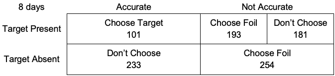

# Eyewitness Identification and the Time Delay
## Executive Summary
Eyewitnesses have long played a significant role in criminal investigations and prosecutions. The amount of time taken for witnesses to arrive at a decision might affect the accuracy of their memory. Some research shows that time delay of an initial identification is a strong predictor of accuracy, and the identification accuracy worsens as the time delay increases. The client wonders the connection between the time delay and accuracy of memory, and whether there are variables that
systematically influence the connection.

## 1. Is the accuracy of memory(```Accuracy```) and the time delay(```Delay```) related?
Before starting the analysis, I omitted one observation with a missing value, so there are 3644 observations. To investigate the connection between the time delay and the accuracy of memory, I fit a logistic regression model. With ```Accuracy``` as a response and ```Delay``` as an explanatory variable, all factors of ```Delay``` are significant based on the p-values (see below).

```
              Estimate   Std. Error   z value   Pr(>|z|)
(Intercept)   -0.41028      0.06944    -5.909   3.45e-09 ***
Delay4day     -0.22862      0.09781    -2.337     0.0194 *
Delay8day     -0.22111      0.09699    -2.280     0.0226 *
DelayImmediate 0.60297      0.09687     6.225   4.83e-10 ***
```

Before dividing the data by the time delay groups, the whole data are used to calculate the accuracy and true positive/negative rates.

## 2. The Accuracy Rate and the True Rates: the whole data
<p align="center"></p>
<h4 align="center">Table 1: Two-way table with the number of observations</h4>

The above table shows the number of participants resulted as accurate or non-accurate on the tests with and without target photos regardless the time delay. The accuracy defines the overall correct result. The true positive rate defines the proportion of target-present observations that are answered (target was chosen) correctly. The true negative rate defines the proportion of target-absent observations that are answered (no targets were chosen) correctly.
- Accuracy Rate = (946+540) / 3644 = 0.41
- True Positive Rate = 946 / (946+583+695) = 0.43
- True Negative Rate = 540 / (540+880) = 0.38

Based on the whole data, the true positive rate is slightly higher than other rates. It means that participants tended to choose the right target with the photo of target rather than not to choose any targets with the photos of innocent people. To investigate how the rate is changed based on the time delay, the data are divided by 4 groups of delayed time: immediate, 2 days, 4 days, and 8 days.


## 3. The Accuracy Rate and the True Rates: 4 time-delay groups
<p align="center"></p>
<h4 align="center">Table 2: Two-way table of the Immediate group</h4>

- Accuracy = (181+304) / 885 = 0.55
- True Positive Rate = 181 / (181+87+170) = 0.41
- True Negative Rate = 304 / (304+143) = 0.68

Based on the Immediate group (Table 2), the overall accuracy and true negative rate are higher than 50%. Especially, the true negative rate is 0.68 which means that 68% of participants tended not to choose innocent person immediately after they witnessed the face of the actor. However, even right after the witnessing, the percentage of choosing the right target among photos with a target is less than a half—the true positive rate.

<p align="center"></p>
<h4 align="center">Table 3: Two-way table of the 2-day group</h4>

- Accuracy = (128+217) / 865 = 0.40
- True Positive Rate = 128 / (128+135+169) = 0.30
- True Negative Rate = 217 / (217+216) = 0.50

Based on the 2-day data (Table 3), all rates are decreased compared to the immediate data. Especially, the true negative rate is decreased by 18%.

<p align="center"></p>
<h4 align="center">Table 4: Two-way table of the 4-day group</h4>

<p align="center"></p>
<h4 align="center">Table 5: Two-way table of the 8-day group</h4>
